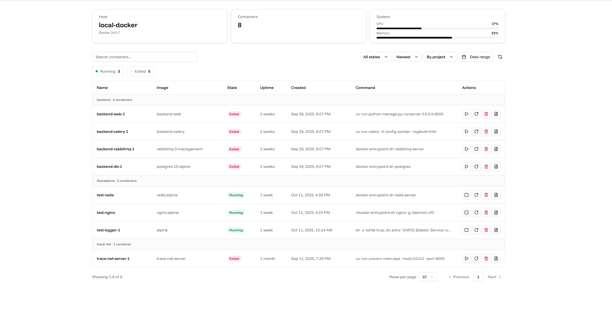
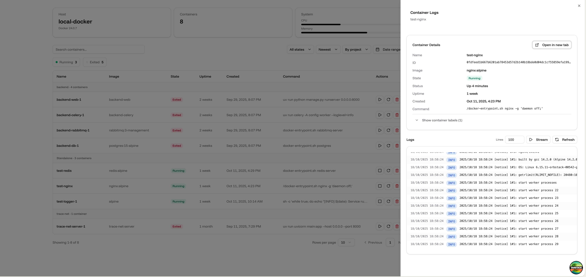

# LogDeck

Logdeck is an open-source project that aims to be the most intuitive and visually appealing tool for monitoring Docker container logs as well as managing containers.




## Getting Started

### Prerequisites

- **Docker Desktop** - [macOS](https://www.docker.com/products/docker-desktop) | [Linux](https://docs.docker.com/engine/install/)

**For native development:**
- **Go 1.22+** - [Install Go](https://go.dev/doc/install)
- **Bun** - [Install Bun](https://bun.sh)

### Quick Start

**Native Development:**
```bash
git clone https://github.com/AmoabaKelvin/logdeck.git
cd logdeck
make install
make dev
```

**Docker Compose:**
```bash
git clone https://github.com/AmoabaKelvin/logdeck.git
cd logdeck
make dev-docker
```

- Backend: http://localhost:8080
- Frontend: http://localhost:5173

### Available Commands

```bash
make help           # Show all available commands
make install        # Install dependencies
make dev            # Run natively (fast hot-reload)
make dev-docker     # Run with Docker Compose
make build          # Build for production
make clean          # Clean build artifacts
make test           # Run tests
make stop-docker    # Stop Docker Compose services
```

### Environment Configuration

```bash
cp .env.example .env
```

### Hot Reload

Both native and Docker development support automatic reloading:
- Frontend (Vite): Hot Module Replacement
- Backend (Go + Air): Automatic rebuild on file changes

### Troubleshooting

**Air not found?**
```bash
echo 'export PATH=$PATH:$(go env GOPATH)/bin' >> ~/.bashrc
source ~/.bashrc
```

**Docker volume permissions (Linux)?**
```bash
sudo chown -R $USER:$USER .
```

## Roadmap for v1.0.0

- [ ] Container discovery

  - [ ] Automatically discover all running containers
  - [ ] Host name, docker version
  - [ ] Host system usage (CPU, memory)
  - [ ] Show container name, image, status, uptime
  - [ ] Real-time updates when containers start/stop
  - [ ] Group containers by project, network, label, etc.
  - [ ] View container details (env vars, volumes, ports, labels, etc.)

- [ ] Log viewing

  - [ ] Real-time log streaming (tail -f style)
  - [ ] Historical logs with option for getting X number of lines
  - [ ] Auto-scroll toggle for streaming logs
  - [ ] Timestamps (toggleable)
  - [ ] Color-coded log levels (ERROR, WARN, INFO, DEBUG)
  - [ ] Download logs as file (downloading both the parsed logs as well as the raw logs)
  - [ ] Pause/resume streaming

- [ ] Basic filtering

  - [ ] Search/filter logs by text
  - [ ] Filter by log level
  - [ ] Date range filtering
  - [ ] Regex support (minimal support for now)

- [ ] Container Life Cycle Management

  - [ ] Start, stop, restart, remove containers (Later on this should be a feature flag that can be enabled/disabled, sometimes we might just want a read only view of the containers and their logs)
  - [ ] View container stats (CPU, memory)
