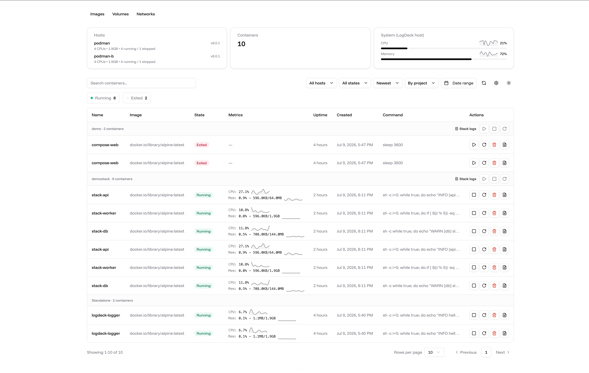
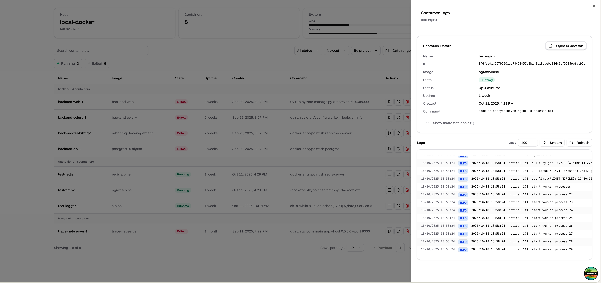

# LogDeck

LogDeck is an open-source, high-performance Docker container monitoring and management tool. Built for speed and ease of use, it provides real-time log streaming, multi-host support, and a beautiful interface for managing your containers.

## Features

### Real-Time Log Streaming

- Live log streaming (tail -f style) with play/pause controls
- Historical log viewing with configurable line counts
- Auto-scroll toggle during streaming
- Toggleable timestamps and text wrapping
- Log download in JSON or TXT format

### Log Persistence & History

Logs are stored locally, so history outlives the container that produced it:

- Every container on every host is tailed into a local SQLite store (enabled by default)
- A **Live | History** toggle in the log viewer searches everything stored, server-side
- History survives restarts and rebuilds that give a container a new ID (`docker compose up --build`)
- Containers that no longer exist show up under a **Removed** filter with their stored logs still readable
- Retention caps (50 MB per container, 1024 MB total by default) evict oldest-first
- Aggregated stack logs remain live-only

Requires the `/data` volume (see [docker-compose.yml](./docker-compose.yml)). Full details in the [Log History guide](https://logdeck.dev/docs/log-history).

### Alerting

- Event rules on container death (non-zero exit) and OOM kills
- Log rules on a minimum level, a regex pattern, or both
- Rate thresholds ("5 matches in 60 seconds") and per-rule cooldowns that report suppressed counts
- Target rules by host, container name, or Compose project
- One JSON webhook that Slack and Discord incoming webhooks accept unchanged
- Alert history with the delivery result of every notification
- Manage it from Settings, or with `logdeck alerts` from the terminal

See the [Alerting guide](https://logdeck.dev/docs/alerting).

### Advanced Log Filtering & Search

- Full-text search with highlighting, plus highlight or exclude modes
- Search navigation (previous/next match with match counter)
- Filter by log level (TRACE, DEBUG, INFO, WARN, ERROR, FATAL, PANIC)
- Time range presets and a custom calendar range
- Color-coded log level badges, collapsible JSON lines, and line pinning

### Multi-Host Docker Support

Manage containers across multiple Docker hosts from a single interface:

- Connect to local Unix sockets, remote SSH, or TCP endpoints
- Filter and view containers by specific host or across all hosts
- Real-time container state synchronization
- Secure SSH-based connections with key authentication
- Host-aware operations and log streaming

For detailed configuration, see the [Multi-Host Setup Guide](./multi-host.md).

### Podman Support

LogDeck works with Podman as well as Docker, using Podman's Docker-compatible API:

- Automatic detection of local Docker and Podman sockets (rootless and rootful)
- Logs, stats, lifecycle actions, events, and the terminal all work unchanged
- Compose grouping recognizes both Docker Compose and podman-compose projects
- Mix Docker and Podman hosts in a single multi-host setup
- Caveat: health badges are Docker-only. LogDeck reads health from the engine's container list; Docker embeds it there, Podman's Docker-compatible list API does not.

For setup instructions, see the [Podman Setup Guide](./podman.md).

### Command-Line Interface

A scriptable `logdeck` CLI talks to the server's HTTP API — built for automation and AI agents:

- List containers and stacks, inspect, read/follow/search logs, and check stats from the terminal
- `logdeck grep` searches the recent logs of every running container across all hosts
- Lifecycle actions, resource limits, and compose stack controls
- Manage alert rules, the webhook, and alert history with `logdeck alerts`
- Table output for humans, JSON/NDJSON output (`-o json`) for machines

See the [CLI Guide](./docs/cli.md) for installation and every command.

### Container Lifecycle Management

- Start, stop, restart, and remove containers
- Confirmation dialogs for destructive actions
- Health status badges (healthy, unhealthy, starting) for containers with a healthcheck
- Read-only mode for monitoring-only deployments
- Real-time state updates

### Compose Stack Tools

- Start, stop, or restart a whole Compose stack from its group header
- Aggregated stack logs: every container's logs merged by timestamp in one view, with color-coded container badges
- Works with Docker Compose and podman-compose projects

### Stats & Trends

- Live CPU and memory readings per container
- Sparkline trend lines showing the last five minutes of CPU and memory history
- Per-host engine stats (CPUs, memory, container counts, version) in multi-host setups
- System stats for the machine running LogDeck

### Resource Limits & Restart Policies

- Edit memory limits, CPU limits, and restart policies from the container page
- Applied live via the engine's update API — no container recreate, no downtime

### Images, Volumes & Networks

- Read-only views of images, volumes, and networks across all configured hosts
- Text filtering and per-host error reporting

### Container Discovery & Organization

- Automatic discovery of all running containers
- Group containers by Docker Compose project
- Filter by state (running, exited, paused, restarting, dead)
- Search by container name, ID, or image
- Sort by creation date
- Date range filtering

### Interactive Terminal

- WebSocket-based container terminal access
- Full terminal emulation with XTerm.js
- 10,000 line scrollback history
- Copy-to-clipboard support

### Environment Variables Management

- View and edit container environment variables
- Bulk import from .env files
- Support for quoted values and comments

### Modern UI/UX

- Clean, intuitive dashboard with summary cards
- Dark mode support
- Responsive design (mobile, tablet, desktop)
- URL state persistence for shareable views
- Accessible UI components

### Authentication & Security

- Optional authentication — enable it from Settings, pin it with environment variables, or run open
- JWT session login for the web UI, with a rate-limited login endpoint
- **Scoped API tokens** (`ldk_...`) for the CLI and external tools:
  - `admin` — full access
  - `read` — can read logs, history, stats, events, and container details, but cannot mutate anything, open the web terminal, read container environment variables, or read settings
- Read-only mode: blocks container actions, stack actions, environment and resource edits, and the web terminal

### Configuration & Storage

LogDeck reads environment variables and a JSON config file that the Settings page writes; environment variables win and pin the value so the UI cannot change it.

Everything it persists lives in one directory (`/data` by default, `CONFIG_PATH` to move it):

- `config.json` — hosts, Coolify hosts, read-only mode, auth, API tokens, alert rules, log-store settings
- `logs.db` — the SQLite log store
- `alerts-history.json` — recently fired alerts

**Mount it as a volume.** Without one, all of the above is written inside the container and lost when it is recreated.

See the [Configuration guide](https://logdeck.dev/docs/configuration) for every environment variable.
