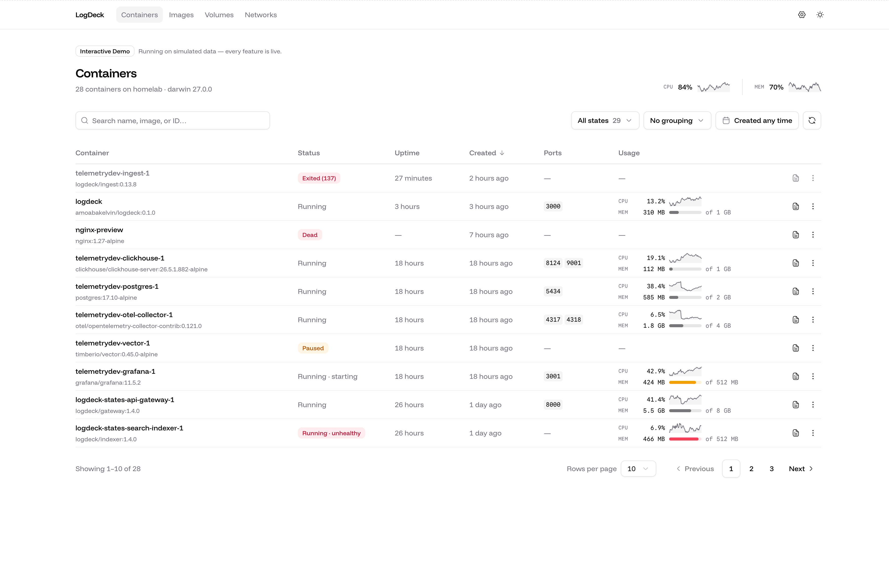
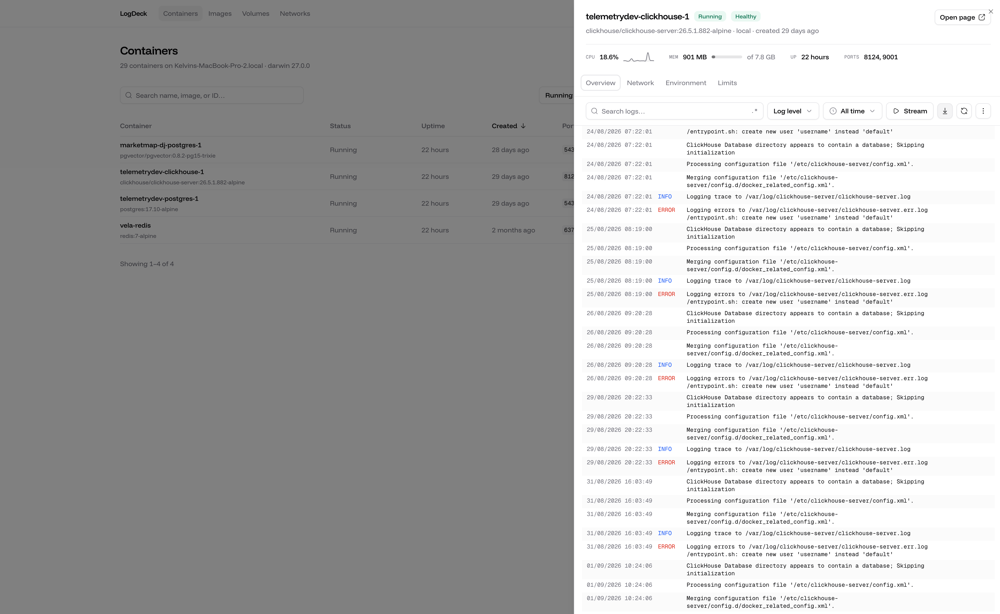

# LogDeck

Self-hosted logs, alerting and container management for Docker and Podman, in one Go binary. Logs are stored on disk so they survive restarts, rebuilds and removal. An MCP server and a CLI let scripts and AI agents read logs and act on containers.

**[Website](https://logdeck.dev)** · **[Live demo](https://logdeck.dev/demo)** · **[Docs](https://logdeck.dev/docs/getting-started)**




## Quick start

```bash
docker run -d --name logdeck \
  -p 8123:8080 \
  -v /var/run/docker.sock:/var/run/docker.sock \
  -v /proc:/host/proc:ro \
  -v logdeck-data:/data \
  --restart unless-stopped \
  amoabakelvin/logdeck:latest
```

Open http://localhost:8123. Keep the `logdeck-data` volume: it holds the config, the stored logs and the alert history.

LogDeck starts without a login. Turn on authentication in Settings before exposing it beyond your machine. For Compose, multiple hosts, SSH and Podman, see the [installation guide](https://logdeck.dev/docs/installation).

## What it does

- Streams logs live and keeps them on disk, so `docker compose up --build` and removed containers no longer lose history
- Searches by text, regex and level across everything stored, with time ranges and pinned lines
- Starts, stops, restarts and removes containers or whole Compose stacks, with an interactive terminal
- Edits environment variables, memory and CPU limits and restart policies without recreating the container
- Alerts on container death, OOM kills and log patterns, to Slack, Discord, ntfy, Gotify, Telegram or any webhook
- Shows live CPU and memory per container, per host and for the machine running LogDeck
- Connects to many Docker or Podman hosts over a socket, TCP or SSH from one UI
- Ships a `logdeck` CLI and an MCP server so scripts and AI assistants see what the UI sees

The [features page](https://logdeck.dev/docs/features) has the full list.

## CLI and MCP

```bash
curl -fsSL https://raw.githubusercontent.com/AmoabaKelvin/logdeck/main/install.sh | sh
logdeck grep "connection refused"   # search recent logs of every running container
logdeck mcp                          # MCP server over stdio for Claude, Cursor, Claude Code
```

Both authenticate with a scoped API token from Settings: `read` can only look, `admin` can act. See the [CLI reference](https://logdeck.dev/docs/cli) and the [MCP guide](https://logdeck.dev/docs/mcp).

## Learn more

- [Log history](https://logdeck.dev/docs/log-history): how storage, retention and the Removed filter work
- [Alerting](https://logdeck.dev/docs/alerting): rules, channels and cooldowns
- [Configuration](https://logdeck.dev/docs/configuration): every environment variable and the config file
- [Multi-host](./multi-host.md) and [Podman](./podman.md) setup notes
- [LogDeck vs Dozzle](https://logdeck.dev/compare/dozzle)

## License

GPL-3.0. Free, no open-core paywall, no external services.
